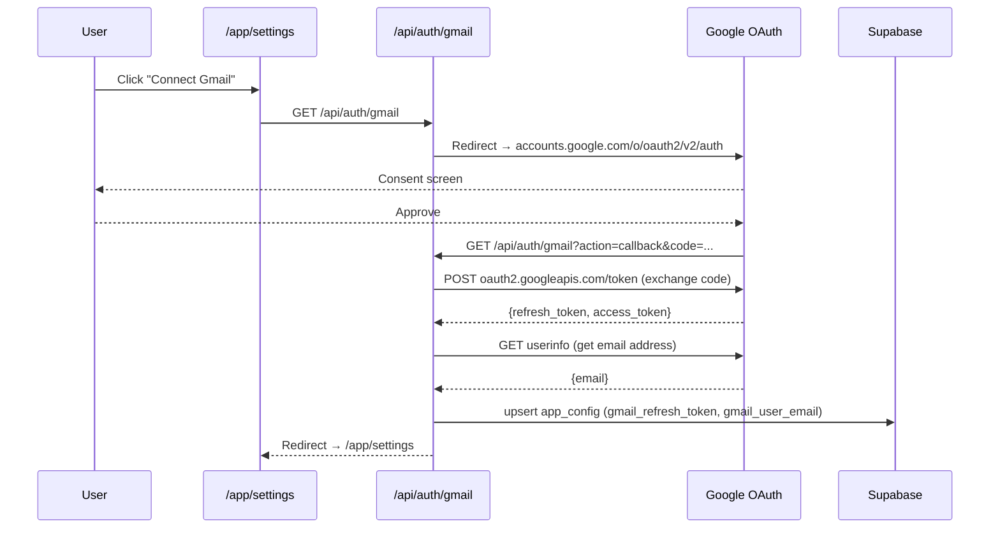
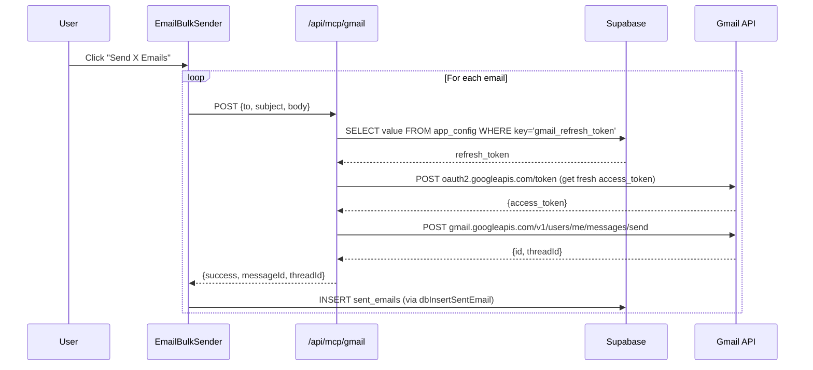

# Gmail Setup Guide — ReachOut

> **One-time setup.** Once connected, your Gmail refresh token is stored in Supabase and works across all your devices — no re-auth needed.

---

## Overview

ReachOut sends emails directly from your personal Gmail using **OAuth 2.0 offline access**. The flow:

1. You click **Connect Gmail** in Settings
2. Google redirects you to consent → you approve
3. Google redirects back to `/api/auth/gmail?action=callback`
4. The server exchanges the auth code for a **refresh token** + gets your Gmail address
5. Both are saved to your **Supabase `app_config` table** (keys: `gmail_refresh_token`, `gmail_user_email`)
6. When you send emails, `/api/mcp/gmail` reads the refresh token from Supabase, gets a fresh access token from Google, and sends via the Gmail API





---

## Step 1 — Create a Google Cloud Project

1. Go to [console.cloud.google.com](https://console.cloud.google.com/)
2. Click the project dropdown (top left) → **New Project**
3. Name it (e.g. `ReachOut`) → **Create**
4. Select the project from the dropdown

---

## Step 2 — Enable the Gmail API

1. In the sidebar → **APIs & Services → Library**
2. Search for **"Gmail API"** → click it → **Enable**

---

## Step 3 — Configure the OAuth Consent Screen

> You only need to do this if you haven't set up a consent screen before.

1. **APIs & Services → OAuth consent screen**
2. User type: **External** → **Create**
3. Fill in:
   - **App name**: `ReachOut` (or anything)
   - **User support email**: your Gmail
   - **Developer contact**: your Gmail
4. Click **Save and Continue**
5. On the **Scopes** page → **Add or Remove Scopes** → search and add:
   - `https://www.googleapis.com/auth/gmail.send`
   - `https://www.googleapis.com/auth/gmail.readonly`
   - `https://www.googleapis.com/auth/userinfo.email`
6. **Save and Continue**
7. On **Test users** → **+ Add users** → add your Gmail address
8. **Save and Continue** → **Back to Dashboard**

> [!NOTE]
> Since this is a personal tool, you don't need to go through Google's app verification. Staying in "Testing" mode is fine — you (as a test user) can use it indefinitely.

---

## Step 4 — Create OAuth 2.0 Credentials

1. **APIs & Services → Credentials**
2. Click **+ Create Credentials → OAuth client ID**
3. Application type: **Web application**
4. Name: `ReachOut Web Client` (or anything)
5. Under **Authorized redirect URIs** → **+ Add URI** — add both:

   ```
   http://localhost:3000/api/auth/gmail?action=callback
   https://your-app.vercel.app/api/auth/gmail?action=callback
   ```

   Replace `your-app.vercel.app` with your actual Vercel URL.

6. Click **Create**
7. Copy the **Client ID** and **Client Secret** shown in the popup

---

## Step 5 — Add Environment Variables

### Local development (`.env.local`)

```env
NEXT_PUBLIC_BASE_URL=http://localhost:3000
GOOGLE_CLIENT_ID=your_client_id.apps.googleusercontent.com
GOOGLE_CLIENT_SECRET=your_client_secret
```

### Vercel — Project Settings → Environment Variables

| Variable | Value |
|---|---|
| `NEXT_PUBLIC_BASE_URL` | `https://your-app.vercel.app` |
| `GOOGLE_CLIENT_ID` | your client ID |
| `GOOGLE_CLIENT_SECRET` | your client secret |

> [!IMPORTANT]
> `NEXT_PUBLIC_BASE_URL` must exactly match the domain you added as an Authorized Redirect URI in Step 4. If they don't match, Google will reject the OAuth callback with a `redirect_uri_mismatch` error.

---

## Step 6 — Connect Gmail in the App

1. Open the app → **Settings** (bottom nav or sidebar)
2. Click **Connect Gmail**
3. You'll be redirected to Google's consent screen — sign in with your Gmail
4. Click **Allow** on the permissions screen
5. You'll be redirected back to Settings — you'll see "Connected" with your Gmail address
6. ✅ Done — the refresh token is now stored in your Supabase `app_config` table

---

## Step 7 — Verify Supabase Storage

After connecting, confirm the token was saved:

1. Open your [Supabase Dashboard](https://app.supabase.com)
2. Go to **Table Editor → app_config**
3. You should see two rows:
   - `key: gmail_refresh_token` — a long token string
   - `key: gmail_user_email` — your Gmail address

This means any device you log into will automatically have Gmail connected — no re-auth needed.

---

## Troubleshooting

| Problem | Fix |
|---|---|
| `redirect_uri_mismatch` | The redirect URI in Google Console must exactly match `NEXT_PUBLIC_BASE_URL/api/auth/gmail?action=callback` |
| `Token exchange failed` | Check `GOOGLE_CLIENT_ID` and `GOOGLE_CLIENT_SECRET` are set in Vercel env vars |
| No `refresh_token` returned | Google only returns it on first consent. Go to [myaccount.google.com/permissions](https://myaccount.google.com/permissions), remove the app, then reconnect |
| Gmail connected but emails fail | Check the Supabase `app_config` table has `gmail_refresh_token`. If missing, disconnect and reconnect |
| `GOOGLE_CLIENT_ID not configured` | The env var is missing — check Vercel → Settings → Environment Variables |
| Consent screen shows "This app isn't verified" | Click **Advanced → Go to ReachOut (unsafe)** — this is expected for personal/testing apps |

---

## OAuth Scopes Used

| Scope | Why |
|---|---|
| `gmail.send` | Send emails on your behalf |
| `gmail.readonly` | Needed to fetch thread IDs for Gmail links in follow-ups |
| `userinfo.email` | Get your Gmail address to display in Settings and email headers |

---

## Security Notes

- The refresh token is stored in **your own Supabase database** — not in any third-party system
- The token is only used server-side inside `/api/mcp/gmail` — it never reaches the browser
- All `/api` routes are protected by the login middleware — only you can trigger Gmail sends
- Google refresh tokens for Gmail don't expire unless you revoke them or change your Google password

---

## Revoking Access

If you want to disconnect Gmail:

1. Click **Disconnect Gmail** in Settings → this deletes the token from Supabase
2. Optionally revoke at [myaccount.google.com/permissions](https://myaccount.google.com/permissions) → find the app → **Remove Access**
